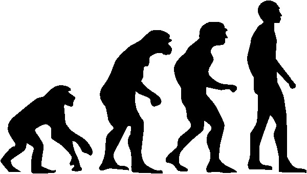

# Hominidae

Repository containing a [COL Data Package](https://github.com/CatalogueOfLife/coldp) representing extant and extinct species of [great apes](https://en.wikipedia.org/wiki/Hominidae), mostly based on wikipedia 
with special focus on the [human taxonomy](https://en.wikipedia.org/wiki/Human_taxonomy).
The dataset is registered with [ChecklistBank](https://www.checklistbank.org/dataset/147251) and [GBIF](https://www.gbif.org/dataset/7be186c4-5572-44e6-9f11-69ddbfd95078).

So far only the [Hominini](https://en.wikipedia.org/wiki/Hominini) tribe is covered, but the remaining taxa from the family will follow.

## Credits
The  is originally from [Tkgd2007](https://commons.wikimedia.org/wiki/File:Human_evolution.svg), [CC BY-SA 3.0](https://creativecommons.org/licenses/by-sa/3.0) , via Wikimedia Commons.
